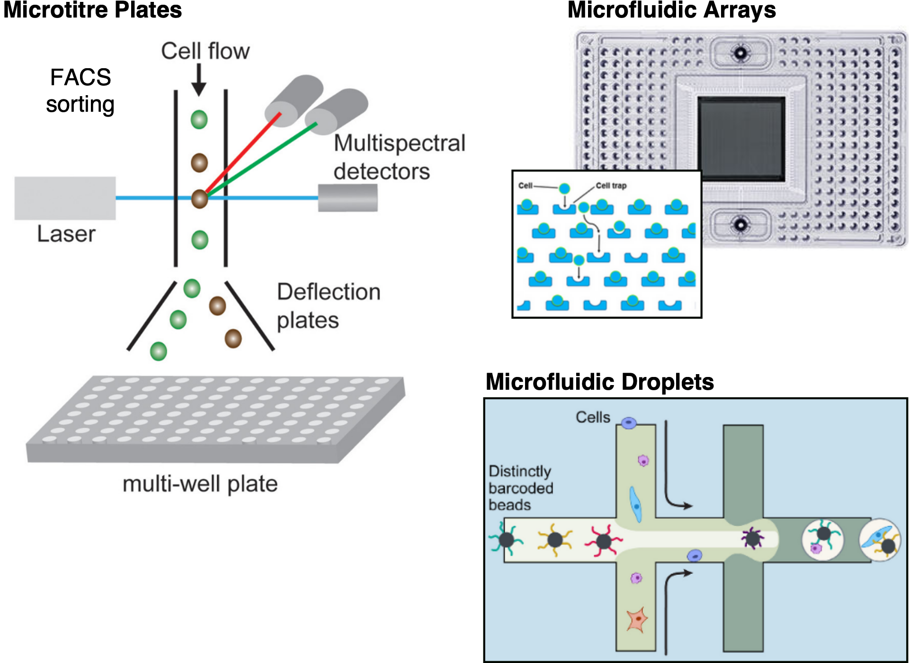

# 단일 세포 RNA-seq 소개

```{r Intro0, echo=FALSE}
library(knitr)
opts_chunk$set(cache = TRUE, fig.align = "center", echo=FALSE)
```

:::highlight
**질문**

- 단일 세포 RNA-seq(scRNA-seq)란 무엇이며 대량 RNA-seq와 어떻게 비교됩니까?
- scRNA-seq의 일반적인 응용 분야는 무엇입니까?
- scRNA-seq를 위해 샘플은 일반적으로 어떻게 준비됩니까?
- 가장 널리 사용되는 프로토콜 간의 차이점은 무엇이며 장단점은 무엇입니까?
- scRNA-seq에서 어떤 실험 설계 선택을 고려해야 합니까?
- 대량 데이터와 비교하여 scRNA-seq 데이터의 몇 가지 과제는 무엇입니까?
:::


## 단일 세포 RNA-seq 개요

RNA-seq를 사용하면 샘플의 전사체를 효율적이고 비용 효율적인 방식으로 프로파일링할 수 있습니다.
이는 00년대 후반에 주요한 돌파구였으며 그 이후로 더욱 인기를 얻어 마이크로어레이와 같은 다른 전사체 프로파일링 기술을 대체했습니다.
성공의 일부는 RNA-seq가 사전 결정된 전사체 세트(마이크로어레이 또는 RT-qPCR에서와 같이)로 제한되지 않고 샘플의 모든 전사체를 편향되지 않게 샘플링할 수 있다는 사실 때문입니다.

일반적으로 RNA-seq는 **대량 RNA-seq**라고 하는 세포 혼합물로 구성된 샘플에 사용되었으며 많은 응용 분야가 있습니다.
예를 들어 건강/질병, 야생형/돌연변이 또는 대조군/처리된 샘플에서 조직 간의 발현 특징을 특성화하는 데 사용할 수 있습니다.
또는 진화 연구에서 여러 종에 걸쳐 조직 샘플의 비교 전사체학을 사용합니다[참조].
전사체 정량화에 사용되는 것 외에도 모델 및 비모델 유기체 모두에서 새로운 유전자, 유전자 동위형 및 기타 전사체를 찾고 주석을 다는 데 사용할 수 있습니다.

그러나 대량 RNA-seq를 사용하면 해당 샘플의 개별 세포에 걸친 유전자 발현의 이질성을 고려하지 않고 세포 집단에 걸쳐 각 유전자의 **평균 발현 수준**만 추정할 수 있습니다.
따라서 초기 발생 연구 또는 뇌와 같은 복잡한 조직과 같은 이질적인 시스템을 연구하는 데는 불충분합니다.

(figures/bulk_vs_singlecell_sequencing.jpg)

이 한계를 극복하기 위해 단일 세포 수준(scRNA-seq)에서 RNA-seq를 적용할 수 있는 새로운 프로토콜이 개발되었으며, 2009년에 첫 번째 간행물이 발표되었습니다[@Tang2009-bu].
이 기술은 새로운 프로토콜과 낮은 시퀀싱 비용으로 더 쉽게 접근할 수 있게 된 2014년경부터 더 인기를 얻었습니다([ref](https://doi.org/10.1038/nmeth.2801)).
대량 접근 방식과 달리 scRNA-seq를 사용하면 세포 집단에 걸쳐 각 유전자의 **발현 수준 분포**를 추정할 수 있습니다.

이를 통해 **전사체에서 세포 특이적 변화**가 중요한 새로운 생물학적 질문에 답할 수 있습니다. 예를 들어 새롭거나 희귀한 세포 유형을 발견하고, 건강/질병 조직 간의 차등 세포 구성을 식별하고, 발생 중 세포 분화를 이해하는 것입니다.
이 기술의 가장 상징적인 용도 중 하나는 아래 상자에 표시된 유전자 지도책을 구축하는 것입니다. 이는 유기체의 세포 다양성에 대한 포괄적인 개요를 제공하며 건강 및 기초 연구에 많은 응용 분야가 있습니다.

:::note
**단일 세포 지도책**

유기체의 포괄적인 세포 목록을 제공하려는 많은 프로젝트가 있습니다.
다음은 이러한 프로젝트 중 일부의 비소모적인 목록입니다.

- [인간 세포 지도책](https://www.humancellatlas.org/) (*H. sapiens*)
- [Tabula Muris](https://tabula-muris.ds.czbiohub.org/) (*M. musculus*)
- [초파리 세포 지도책](https://flycellatlas.org/) (*D. melanogaster*)
- [벌레 세포 지도책](https://atlas.gs.washington.edu/worm-rna/) (*C. elegans*)
- [애기장대 뿌리 지도책](https://bioit3.irc.ugent.be/plant-sc-atlas/root) (*A. thaliana*)
:::

scRNA-seq 데이터 세트는 연구당 수백에서 수백만 개의 세포에 이르며 매년 크기가 증가합니다.
상업용 및 오픈 액세스 모두 여러 가지 다른 프로토콜을 사용할 수 있으며 각각 고유한 장점과 단점이 있습니다.
다음 섹션에서 이러한 측면 중 일부에 대해 논의할 것입니다.

```{r Exp-methods1, fig.cap="단일 세포 전사체학의 무어의 법칙은 10년이 조금 넘는 기간 동안 실험 처리량이 수십 개에서 수백만 개의 세포로 증가했음을 보여줍니다. (이미지 출처: [Svensson et al.](https://arxiv.org/abs/1704.01379))", out.width = '100%'}
knitr::include_graphics("figures/moores-law.png")
```


## 샘플 준비 프로토콜

일반적으로 일반적인 scRNA-seq 프로토콜은 아래 그림에 설명된 대로 다음 단계로 구성됩니다.

- 조직 해부 및 세포 해리를 통해 세포 현탁액을 얻습니다.
- 선택적으로 세포를 선택할 수 있습니다(예: 막 마커, 형광 트랜스진 또는 염색 염료 기준).
- 단일 세포를 개별 반응 용기(예: 웰 또는 오일 방울)에 포획합니다.
- 각 세포에서 RNA를 추출합니다.
- RNA를 더 안정적인 cDNA로 역전사합니다.
- cDNA를 증폭합니다(_시험관 내_ 전사 또는 PCR에 의해).
- 적절한 분자 어댑터로 시퀀싱 라이브러리를 준비합니다.
- 일반적으로 페어드 엔드 Illumina 프로토콜로 시퀀싱합니다.
- 원시 데이터를 처리하여 유전자별 세포의 카운트 매트릭스를 얻습니다.
- 여러 다운스트림 분석을 수행합니다(이 과정의 초점).

이 과정은 이 워크플로의 마지막 단계를 주로 다루지만, 그 이전에 오는 몇 가지 단계를 고려하는 것이 중요합니다. 왜냐하면 우리가 얻는 데이터의 속성에 영향을 미치기 때문입니다.

.](figures/singlecell_sequencing_workflow.png)


:::note
**단일 핵 RNA-seq**

세포 해리가 어렵거나 냉동된 조직 샘플의 경우 전체 단일 세포를 분리하는 대신 단일 핵을 분리할 수 있습니다.
분리 단계 외에 단일 핵 시퀀싱 라이브러리를 준비하는 프로토콜은 단일 세포 프로토콜과 유사합니다.
그러나 핵 RNA는 일반적으로 처리되지 않은 RNA의 비율이 더 높으며 시퀀싱된 전사체 중 더 많은 부분이 인트론을 포함합니다.
이러한 측면은 다음 장에서 자세히 설명하는 데이터 처리 단계에서 고려해야 합니다.
:::

현재 scRNA-seq 데이터를 준비하기 위한 다양한 프로토콜이 있으며 각각 고유한 장점과 단점이 있으며 아래에서 설명하겠습니다.
이러한 방법은 여러 가지 방식으로 분류할 수 있지만 가장 중요한 두 가지 측면은 __세포 포획 또는 분리__ 및 __전사체 정량화__입니다.

)](figures/singlecell_protocols.jpeg)


## 세포 포획

세포 포획에 사용되는 전략은 실험의 처리량(즉, 얼마나 많은 세포를 분리하는지), 시퀀싱 전에 세포를 선택하는 방법, 그리고 전사체 시퀀싱 외에 어떤 종류의 추가 정보를 얻을 수 있는지를 결정합니다.
가장 널리 사용되는 세 가지 옵션은 __마이크로타이터 플레이트 기반__, __미세 유체 어레이 기반__ 및 __미세 유체 방울 기반__ 방법입니다.



**마이크로타이터 플레이트** 방법은 피펫팅, 미세 해부 또는 형광 활성화 세포 분류(FACS)와 같은 방법을 사용하여 플레이트의 개별 웰에 세포를 분리하는 데 의존합니다.
웰 기반 방법의 한 가지 장점은 라이브러리 준비 전에 세포의 사진을 찍어 추가 데이터 양식을 제공할 수 있다는 것입니다.
예를 들어 손상된 세포를 식별하고 버리거나 이중체(둘 이상의 세포가 있는 웰)가 포함된 웰을 찾을 수 있습니다.
자동 FACS 분류를 사용할 때 세포 크기 및 사용된 라벨의 강도와 같은 정보를 웰 좌표와 연관시켜 다운스트림 분석에서 개별 세포 지수와 연관시킬 수도 있습니다.
이러한 방법의 주요 단점은 종종 처리량이 낮고 세포당 필요한 작업량이 상당할 수 있다는 것입니다.

**미세 유체 어레이** 플랫폼(예: [Fluidigm의 C1](https://www.fluidigm.com/products/c1-system#workflow))은 세포 포획 및 라이브러리 준비에 필요한 반응을 수행하기 위한 보다 통합된 시스템을 제공합니다.
따라서 마이크로타이터 플레이트 기반 방법보다 더 높은 처리량을 제공합니다. 일반적으로 미세 유체 플랫폼에서는 약 10%의 세포만 포획되므로 희귀한 세포 유형이나 매우 적은 양의 입력을 다룰 때는 적합하지 않습니다.
또한 나노웰이 특정 크기에 맞게 맞춤화되어 있기 때문에 어레이에 의해 포획되는 세포 크기에 주의해야 합니다(따라서 복잡한 조직에서 세포의 편향되지 않은 샘플링에 영향을 미칠 수 있음).
또한 칩은 상대적으로 비싸지만 더 작은 부피에서 반응을 수행할 수 있으므로 시약 비용을 절약할 수 있습니다.

**미세 유체 방울** 방법은 가장 높은 처리량을 제공하며 오늘날 가장 널리 사용되는 방법입니다. 이 방법은 개별 세포를 비드와 함께 나노리터 크기의 오일 방울 안에 캡슐화하여 작동합니다. 비드에는 라이브러리를 구성하는 데 필요한 효소 및 기타 구성 요소가 로드되어 있습니다. 특히 각 비드에는 해당 세포에서 유래한 모든 시퀀싱 리드에 부착되는 고유한 바코드가 포함되어 있습니다. 따라서 모든 방울을 풀링하고 함께 시퀀싱한 다음 해당 바코드를 기반으로 리드를 원래 세포에 할당할 수 있습니다. 방울 플랫폼은 세포당 0.05달러 정도의 비교적 저렴한 라이브러리 준비 비용을 가집니다. 대신 시퀀싱 비용이 종종 제한 요인이 되며 일반적인 실험에서는 적용 범위가 낮고 수천 개의 다른 전사체만 감지됩니다[@Ziegenhain2017-cu].
 
:::note
형광 활성화 세포 분류(FACS)는 세포의 하위 집단을 선택하기 위해 모든 포획 방법의 업스트림에서 사용할 수 있습니다.
이것이 사용되는 일반적인 방법은 살아있는 세포와 죽은 세포를 구별하는 염료로 세포를 염색하여(예: 막 파열로 인해) 세포 현탁액을 생존 가능한 세포로 농축하는 것입니다.
:::


## 전사체 정량화

전사체 정량화에는 __전장__ 및 __태그 기반__의 두 가지 유형이 있습니다.
전장 프로토콜은 전체 전사체에 걸쳐 균일한 리드 적용 범위를 달성하려고 시도하는 반면 태그 기반 프로토콜은 5' 또는 3' 말단만 포획합니다. 정량화 방법의 선택은 데이터가 어떤 유형의 분석에 사용될 수 있는지에 중요한 영향을 미칩니다.

단일 세포용 전장 라이브러리를 준비하는 것은 기본적으로 대량 RNA-seq에서 수행되는 것과 동일하며(아래 그림) SMART-seq2와 같은 플레이트 기반 프로토콜로 제한됩니다.
이론적으로 전장 프로토콜은 전사체의 균일한 적용 범위를 제공해야 하지만 때로는 유전자 본체에 걸쳐 적용 범위에 편향이 있을 수 있습니다(아래 그림 참조).
전장 프로토콜은 또한 다른 프로토콜로는 매우 어려운 스플라이스 변이체의 검출을 허용합니다.

![Illumina 시퀀싱을 위한 전장 RNA 라이브러리 준비. 샘플은 폴리(A) 꼬리를 포함하는 RNA에 대해 농축되며, 이는 rRNA 시퀀싱을 피합니다(또한 다른 비코딩 RNA도 놓치는 비용으로). 그런 다음 RNA를 단편화하고 더 안정적인 cDNA로 역전사하고, 각 분자에 Illumina 어댑터를 연결하고 마지막으로 PCR 증폭합니다. 단일 세포 RNA-seq의 경우 웰 특이적 바코드가 있는 어댑터를 사용하여 개별 세포에 속하는 시퀀싱 리드를 식별할 수 있습니다. 이미지 출처 []. ([출처](https://www.labome.com/method/RNA-seq.html))](figures/RNA_library_preparation.png)

```{r Exprs-constr3, out.width = '90%', fig.cap="시퀀싱 리드를 전사체에 정렬한 후 유전자 본체 적용 범위에서 3' 편향의 예. 각 선은 세포의 모든 유전자에 대한 평균 적용 범위를 나타냅니다. 이 예에서 모든 세포에 걸쳐 3' 편향 외에 나머지 세포에 비해 이상치처럼 보이는 세 개의 세포가 있으며 다운스트림 분석에서 제거해야 합니다. 이는 RNA 품질이 더 나쁜 세포일 수 있습니다(예: 분해로 인해)."}
knitr::include_graphics("figures/Exp1_RSEQC_geneBodyCoverage_plot_Combined.png")
```

태그 기반 프로토콜을 사용하면 전사체의 말단 중 하나(3' 또는 5')만 시퀀싱됩니다.
태그 기반 프로토콜의 주요 장점은 전사체 정량화의 정확성을 향상시키는 데 도움이 될 수 있는 고유 분자 식별자(UMI)와 결합할 수 있다는 것입니다.
이러한 개선의 이유는 라이브러리 준비 중 PCR 증폭 단계와 관련이 있으며, 이는 각 분자의 여러 중복 사본을 만듭니다.
이 증폭은 지수적이므로 분자가 최종 라이브러리에서 불공정하게 표현되어 이러한 PCR 중복으로 인해 발현이 과대평가될 수 있습니다.
이 문제를 해결하기 위해 세포 바코드는 단일 분자에 고유한 임의의 뉴클레오티드 서열인 UMI로 고유하게 태그가 지정됩니다.
이 UMI는 시퀀싱 리드의 일부이며 전사체의 풍부함을 정량화할 때 계산적으로 고려될 수 있습니다.
대부분의 현재 scRNA-seq 프로토콜은 인기 있는 방울 기반 _10x Chromium_ 프로토콜을 포함하여 태그 기반이며 아래 그림에 설명되어 있습니다.
태그 기반 프로토콜의 한 가지 단점은 전사체의 한쪽 끝으로만 제한되어 리드를 전사체에 명확하게 정렬하는 능력을 감소시키고 다른 동위형을 구별하기 어렵게 만든다는 것입니다[@Archer2016-zq].

![_10X Chromium_ 프로토콜을 사용한 3' 라이브러리의 프로토콜 개요. 세포는 비드(GEM이라고 함)를 포함하는 개별 오일 방울에 포획됩니다. 개별 비드에는 공통 바코드가 있는 어댑터가 포함되어 있지만 다양하고 뚜렷한 _고유 분자 식별자_(UMI) 서열이 있습니다. 폴리(dT) 프라이머는 폴리-A 꼬리가 있는 mRNA를 cDNA로 역전사하는 데 사용됩니다. 그런 다음 GEM을 깨고 풀링된 cDNA(모든 바코드 세포에서)를 PCR로 증폭합니다. 마지막으로 cDNA를 단편화하고 다른 Illumina 어댑터를 분자의 다른 쪽 끝에 연결합니다. 최종 라이브러리는 세포 특이적 바코드(다른 세포의 리드를 식별하는 데 사용됨)와 분자 특이적 UMI(유전자의 발현을 정량화하는 데 사용됨)를 포함하는 리드로 구성되며, 두 번째 리드는 실제 cDNA 분자의 서열을 포함하며 참조 전사체에 정렬하는 데 사용할 수 있습니다. (출처: [Chromium Next GEMSingle Cell 3ʹ 사용자 가이드](https://assets.ctfassets.net/an68im79xiti/1C16trEdzy1Folq5xbOijE/7e6fb1f504e130bd561d898384da99d9/CG000315_ChromiumNextGEMSingleCell3-_GeneExpression_v3.1_DualIndex__RevB.pdf))](figures/chromium_library.png)

:::note
**5' 또는 3'?**

5' 및 3' 태그 기반 프로토콜의 차이점은 전사체의 어느 쪽 끝이 시퀀싱되는지입니다.
3' 프로토콜이 더 일반적으로 사용되지만 많은 프로토콜이 이제 양쪽 끝에서 시퀀싱을 허용합니다(예: [10x Chromium은 둘 다 지원](https://kb.10xgenomics.com/hc/en-us/articles/360000939852-What-is-the-difference-between-Single-Cell-3-and-5-Gene-Expression-libraries-)).
5' 말단 시퀀싱의 장점은 전사 시작 부위(TSS)에 대한 정보를 얻을 수 있다는 것이며, 이를 통해 세포 간에 차등적인 TSS 사용이 있는지 탐색할 수 있습니다.
:::


## 실험 설계

scRNA-seq 실험을 수행할 때 몇 가지 고려 사항을 고려해야 합니다.
세포당 비용, 필요한 세포 수 또는 각 세포를 얼마나 시퀀싱해야 하는지와 같은 요인은 모두 프로토콜 선택에 영향을 미칠 수 있습니다.
반면에 다른 시간에 처리되는 배치로 인한 편향을 피하기 위해 주의를 기울여야 하며 적절한 복제가 부족하면 수행할 수 있는 분석 유형이 제한되어 관심 있는 일부 질문에 답하는 능력이 제한될 수도 있습니다.


### 어떤 프로토콜을 선택해야 합니까?

가장 적합한 플랫폼은 당면한 생물학적 질문에 따라 다릅니다. 예를 들어, 이질적인 조직의 구성을 특성화하는 데 관심이 있다면 방울 기반 방법이 더 적합합니다. 왜냐하면 매우 많은 수의 세포를 대부분 편향되지 않은 방식으로 포획할 수 있기 때문입니다. 반면에 알려진 표면 마커가 있는 특정 세포 집단을 특성화하는 데 관심이 있다면 FACS를 사용하여 농축한 다음 더 적은 수의 세포를 더 높은 시퀀싱 깊이로 시퀀싱하는 것이 가장 좋습니다.

분명히, 태그가 지정된 프로토콜은 이 점에서 훨씬 더 제한적이므로 다른 동위형을 연구하는 데 관심이 있다면 전장 전사체 정량화가 더 적절할 것입니다. 대조적으로, UMI는 태그가 지정된 프로토콜에서만 사용할 수 있으며 유전자 수준 정량화를 향상시킬 수 있습니다.

희귀한 세포 유형(알려진 마커를 사용할 수 없는 경우)에 관심이 있다면 더 많은 세포를 시퀀싱해야 하므로 실험 비용이 증가합니다.
시퀀싱할 세포 수를 추정하는 유용한 도구는 Satija Lab에서 개발했습니다: https://satijalab.org/howmanycells/.

어떤 방법을 사용할지 결정하는 또 다른 방법은 다른 프로토콜을 비교하는 데 전념하는 연구에 의존하는 것입니다. 이러한 연구는 감도(세포당 얼마나 많은 유전자가 검출되는지), 정확도(예: 대량 RNA-seq와 비교) 및 샘플에 존재하는 모든 세포 유형을 복구하는 능력(상업적으로 이용 가능한 세포 혼합물에 대해 테스트됨)과 같은 문제에 중점을 둡니다.
예를 들어, [Ding et al. 2020](https://doi.org/10.1038/s41587-020-0465-8)의 연구는 10x Chromium과 같은 고처리량 방법에 비해 저처리량 방법이 더 높은 감도를 갖는 방법을 보여줍니다(아래 그림).
반면에 저처리량 방법은 샘플에서 더 희귀한 세포 유형 중 일부를 포획하지 못하여 세포 집단의 불완전한 특성화로 이어졌습니다.

에서 가져왔으며 a) 세포당 검출된 고유 UMI 수(태그 기반 전사체 정량화를 사용하는 방법의 경우) 및 b) 방법 전반에 걸쳐 세포당 검출된 유전자 수를 보여줍니다. 두 개의 실험적 복제 결과가 표시됩니다.](figures/methods_sensitivity.png)

Ziegenhain 등의 또 다른 연구[@Ziegenhain2017-cu]는 동일한 마우스 배아 줄기 세포(mESC) 샘플에 대해 5가지 다른 프로토콜을 비교하여 유사한 결론에 도달했습니다.
그리고 마지막으로, Svensson 등의 연구[@Svensson2017-op]는 알려진 농도의 합성 전사체(스파이크인)를 사용하여 다른 프로토콜의 정확도와 감도를 측정했습니다. 광범위한 연구를 비교하여 프로토콜 간에 상당한 차이가 있음을 보고했습니다(아래 그림).

```{r Exp-methods6, out.width = '100%', fig.cap="[Svensson et al.](https://doi.org/10.1038/nmeth.4220)의 그림으로, a) 정확도(대량 RNA-seq 데이터와의 Pearson 상관 계수로 측정) 및 b) 감도(검출된 분자 수)와 관련하여 다른 프로토콜을 비교합니다."}
knitr::include_graphics("figures/svenssonTeichmannFig2.png")
```

프로토콜이 개발 및 개선되고 기술적 노이즈를 정량화하기 위한 새로운 계산 방법이 등장함에 따라 향후 연구는 다른 방법의 강점에 대한 추가 통찰력을 얻는 데 도움이 될 것입니다. 이러한 비교 연구는 사용할 프로토콜을 결정하는 데 도움이 될 뿐만 아니라 벤치마킹을 통해 가장 유용한 전략이 무엇인지 결정할 수 있으므로 새로운 방법을 개발하는 데도 도움이 됩니다.

프로토콜 간의 처리량 및 감도 차이 외에도 **비용**은 scRNA-seq 실험을 계획할 때 결정적인 요인이 될 수도 있습니다.
실험 비용이 얼마나 들지 정확하게 추정하기는 어렵지만 Satija Lab의 이 도구를 시작점으로 지적합니다: https://satijalab.org/costpercell/.
예를 들어 Drop-seq와 같은 일부 방울 기반 프로토콜은 10x Chromium과 같은 상업적 대안보다 저렴합니다. 그러나 실험실에서 라이브러리를 준비할 수 있는 장비를 갖추고 있어야 하며 훈련된 직원과 전용 시간(급여 비용)이 필요합니다.

_세포 해싱_([Stoeckius et al.](https://doi.org/10.1186/s13059-018-1603-1))과 같은 방법은 현재 플랫폼을 사용한 시퀀싱 비용을 더욱 줄일 수 있습니다.
이 방법은 특히 세포막에 올리고 태그를 부착하여 여러 샘플에서 더 많은 세포를 실험당 로드할 수 있도록 하며, 나중에 분석 중에 다중 분리할 수 있습니다.


### 데이터 과제

대량 및 단일 세포 RNA-seq의 주요 차이점은 각 시퀀싱 라이브러리가 세포 집단 대신 단일 세포를 나타낸다는 것입니다.
따라서 단일 세포 수준에서 "생물학적 복제"를 가질 방법이 없습니다. 각 세포는 고유하며 복제할 수 없습니다.
대신 세포는 유사성에 따라 클러스터링될 수 있으며 그런 다음 유사한 세포 그룹 간에 비교를 수행할 수 있습니다(과정 뒷부분에서 볼 수 있듯이).

단일 세포 RNA-seq의 또 다른 큰 과제는 세포당 시작 물질의 양이 매우 적다는 것입니다.
이로 인해 대부분의 유전자가 검출되지 않는 매우 _희소한_ 데이터가 생성되므로 데이터에 0이 많이 포함됩니다.
이는 유전자가 세포에서 발현되지 않았기 때문일 수도 있고("실제" 0) 유전자가 발현되었지만 검출할 수 없었기 때문일 수도 있습니다("탈락").
이로 인해 항상 생물학적인 것이 아니라 __세포 간의 불균일한 PCR 증폭__ 및 __유전자 "탈락"__으로 인한 기술적 문제로 인한 세포 간 변이가 발생합니다(한 세포에서는 유전자가 검출되지만 다른 세포에서는 없음[@Kharchenko2014-ts]).
전사체 포획 효율을 개선하고 증폭 편향을 줄이는 것이 이러한 문제에 대한 해결책이며 여전히 기술 연구의 활발한 분야입니다.
그러나 이 과정에서 보게 되겠지만 적절한 데이터 정규화를 통해 이러한 문제 중 일부를 완화할 수 있습니다.

고려해야 할 또 다른 중요한 측면은 **배치 효과**입니다.
이러한 효과는 다른 기술을 사용하여 동일한 재료를 시퀀싱할 때도 관찰될 수 있으며(아래 그림), 제대로 정규화되지 않으면 잘못된 결론으로 이어질 수 있습니다.

에서 수정.] (figures/batch_effect_protocols.png)

샘플 처리는 또한 실험적으로 제어되는 변수(예: 치료, 유전자형 또는 질병 상태)와 샘플을 준비하고 시퀀싱하는 시간 간의 **혼란**을 피하는 방식으로 수행되어야 합니다.
예를 들어, 각각 10명의 환자로부터 건강한 조직과 질병 조직을 비교하는 실험을 계획할 때 하루에 10개의 샘플만 처리할 수 있다면 모든 건강한 샘플을 하루에 준비하고 모든 질병 샘플을 다른 날에 준비하는 것보다 매일 5개의 건강한 샘플 + 5개의 질병 샘플을 함께 처리하는 것이 가장 좋습니다(그림).
또 다른 고려 사항은 조직 샘플의 **복제**가 있는지 확인하는 것입니다.
예를 들어, 장기에서 조직을 수집할 때 장기의 다른 부분에서 여러 샘플을 채취하는 것이 좋습니다.
또는 샘플/복제물을 수집하는 시간(유전자 발현의 일주기 변화 가능성으로 인해)을 고려하십시오.
요약하면, scRNA-seq를 수행할 때 실험 설계의 모든 일반적인 모범 사례를 고려해야 합니다.

.](figures/balanced_design.png)


## 요약

:::highlight
**핵심 사항**

- scRNA-seq는 이질적인 세포 집단을 연구하는 데 이상적입니다. 예를 들어 조직을 구성하는 세포 유형을 식별하고, 다른 세포 유형에 대한 "전사 지문"을 정의하고, 세포 분화를 연구하고, 질병이나 환경 요인으로 인한 세포 구성의 변화를 탐색하는 등의 작업을 수행합니다.
- 일반적인 샘플 준비 워크플로는 단일 세포(또는 핵)를 분리하고, RNA를 cDNA로 변환하고, 시퀀싱 라이브러리(Illumina)를 준비하고, 시퀀싱하는 것으로 구성됩니다.
- 많은 단일 세포 프로토콜이 개발되었으며 일부는 공개적으로 사용 가능하고 다른 일부는 상업적으로 제공됩니다. 이들은 주로 처리량(실험당 포획되는 세포 수), 정량화 유형(전장 또는 태그 기반) 및 비용이 다릅니다.
- SMART-seq2는 전장 전사체 정량화를 제공하는 인기 있는 저처리량 방법입니다. 더 작은 세포 그룹을 더 자세히 연구하는 데 이상적입니다(예: 차등 동위형 사용, 저발현 전사체 특성화).
- 10x Chromium은 전사체 정량화(3' 또는 5' 말단에서)에 UMI를 사용하는 인기 있는 고처리량 방법입니다. 매우 이질적인 조직을 연구하고 대규모로 많은 세포 집단을 샘플링하는 데 이상적입니다.
- 실험을 계획할 때 배치 효과로 인한 혼란을 피하고 관심 있는 질문을 해결하기 위해 적절한 수준의 복제를 보장하도록 주의해야 합니다.
:::